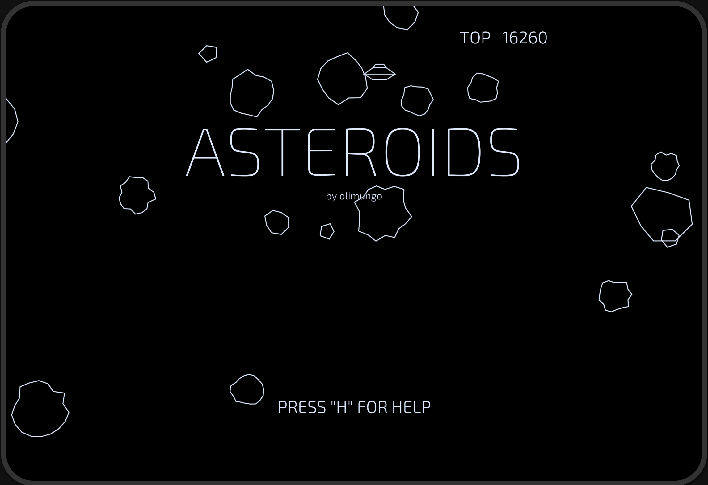
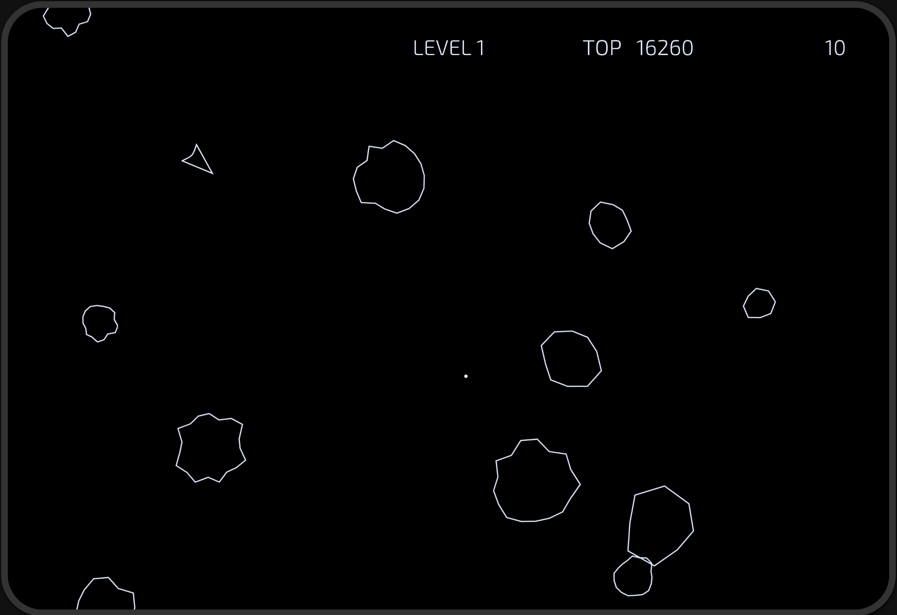

# Asteroids

This is a reboot of the famous video game from 1979. The goal of this project is to learn programming in different languages and having fun.




There are 3 implementations:

-   in TypeScript with p5js (https://p5js.org)
-   in Java with Processing (https://processing.org)
-   in Rust, compiled to WebAssembly (draws directly onto the HTML canvas)

The Typescript and the Rust implementations can be tested at: https://olimungo.github.io/asteroids/

Obviously, the Java implementation must be executed locally on your computer.

## TypeScript

### Requirements

-   node and npm

### Setup

Clone this project, move the the _typescript_ folder and do:

```sh
npm i
```

### Run locally

```sh
npm start
```

## Java

### Requirements

-   install Processing: https://processing.org/download
-   Java JDK: https://www.oracle.com/java/technologies/downloads/

On macOS, you can install Processing with brew:

```sh
brew install --cask processing
```

### Run locally

You can either start Processing and open the sketch _Asteroids.pde_ located into the _java/Asteroids_ folder or install the _processing-java_ command-line.

In order to install the _processing-java_ command, select the item "Install processing-java" in the _Tools_ menu from the Processing IDE.

To execute the sketch using the Processing IDE, just click on the big "Play" button.

To start it at the command-line, use the following command at the root of this project:

```sh
processing-java --force --sketch=`pwd`/java/Asteroids --output=`pwd`/java/Asteroids/out --run
```

To start it in VS Code, use the keyboard shortcut CMD-SHIFT-b on macOS or CTRL-SHIFT-b on Windows and Linux.

## Rust

## Required tools

-   [`Rust`](https://www.rust-lang.org/tools/install) toolchain, including rustup, rustc, and cargo.
-   [`wasm-pack`](https://rustwasm.github.io/wasm-pack/installer/) building, testing, and publishing Rust-generated WebAssembly.
-   [`node and npm`](https://nodejs.org/): version 18 or above
-   cargo-generate helps you get up and running quickly with a new Rust project by leveraging a pre-existing git repository as a template.

Use this command to install cargo-generate:

```shell
cargo install cargo-generate
```

The Rust code can be found into the _src_ folder (file: _lib.rs_).
Use wasm-pack to transpile the Rust code to WebAssembly. This command has to be executed when the _lib.rs_ file is modified and right after cloning the repository.

This command has to be executed in the root folder of the project:

```shell
wasm-pack build
```

For being able to see the Rust functions name executed in the JavaScript profiler of your browser, do a build with the --dev option and debug symbols will be added:

```shell
wasm-pack build --dev
```

### Run locally

Move the _rust_ folder and do:

```sh
wasm-pack build
```

Then move to the _rust/www_ folder and do:

```sh
npm i
```

In the same subfolder launch the DEV server:

```sh
npm start
```

Have fun!
